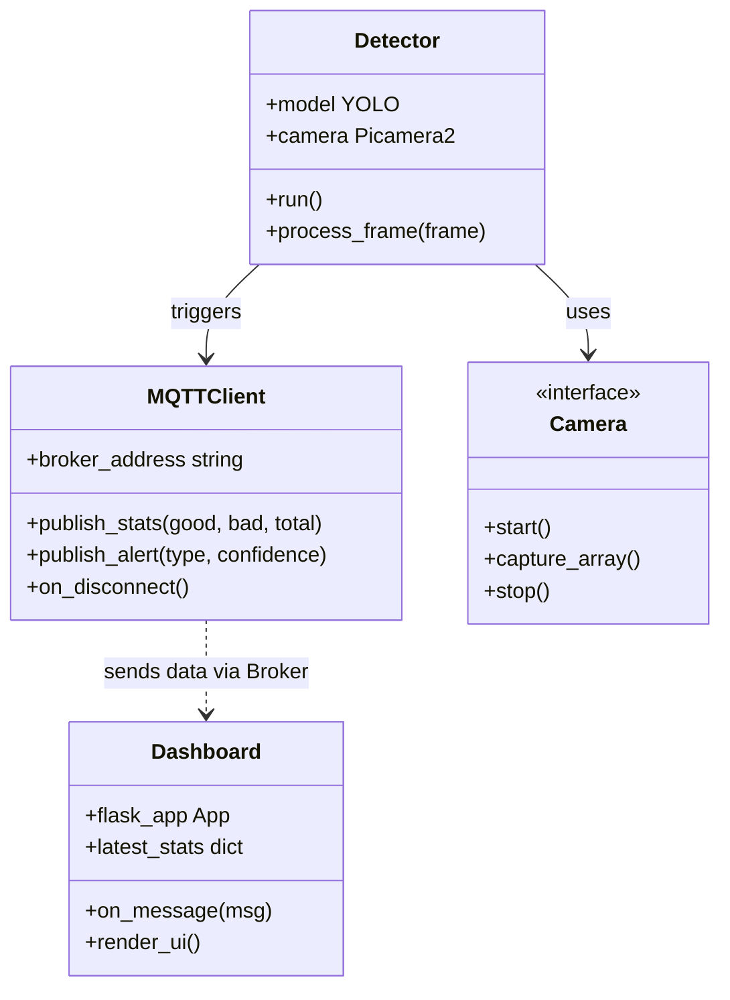
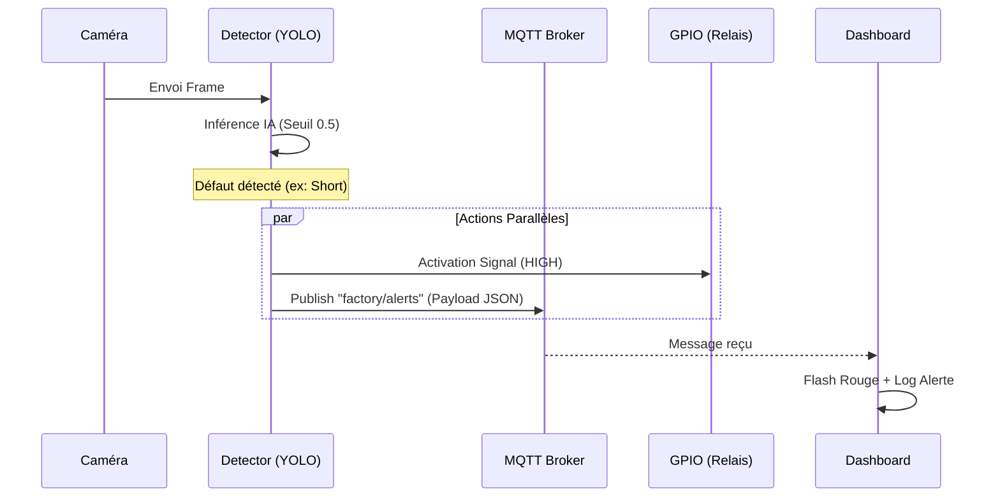

# Documentation Technique : Smart Factory IoT

Ce document détaille la conception, l'architecture et l'implémentation du système
de contrôle qualité automatisé pour circuits imprimés (PCB). Il démontre comment
les technologies de l'IoT et de la vision par ordinateur s'articulent pour
répondre aux exigences de l'Industrie 4.0.

## 1. Introduction Générale

Le passage à l'Industrie 4.0 nécessite une transformation des processus de
contrôle qualité, traditionnellement dépendants de l'expertise humaine et peu
scalables.

### Contexte Industriel
Dans un environnement de fabrication électronique, la rapidité et la précision
sont critiques. L'automatisation du contrôle qualité permet d'intégrer des
boucles de rétroaction immédiates sur la ligne de production, réduisant ainsi le
gaspillage et augmentant la cadence globale.

### Problématique
L'inspection manuelle des circuits imprimés (PCB) présente des limites majeures :
- **Lenteur :** Un opérateur humain ne peut pas suivre les cadences des machines
  de placement CMS (Composants Montés en Surface).
- **Erreur Humaine :** La fatigue visuelle entraîne des oublis de défauts
  critiques (courts-circuits, trous manquants).
- **Coût :** Mobiliser des experts pour une inspection visuelle constante est
  économiquement inefficace.

### Objectifs du Système
Le système Smart Factory a été conçu pour atteindre les performances suivantes :
- **Rapidité :** Détection d'anomalie en moins de 0.5 seconde.
- **Fiabilité :** Taux de détection (Précision) supérieur à 95% sur les défauts
  majeurs.
- **Réactivité :** Signalement électrique (GPIO) et visuel (Dashboard) instantané.

## 2. Architecture et Conception Logicielle (UML)

Le système repose sur une architecture de type **Edge Computing**, découplée
grâce au modèle Publish/Subscribe de MQTT.

### Modélisation des Classes
Le diagramme suivant illustre la structure modulaire du système et les relations
entre les composants de détection et de communication.



### Diagramme de Séquence : Détection d'un Défaut
Ce flux montre l'interaction en temps réel depuis la capture d'image jusqu'à
l'alerte visuelle et physique.



## 3. Réseaux et Protocoles de Communication

### Le Protocole MQTT et Spécifications des Données
Nous utilisons MQTT pour sa légèreté. Les échanges de données sont standardisés
sous forme de payloads JSON.

### Sécurité : Chiffrement TLS/SSL
Pour protéger les données industrielles contre l'interception et l'usurpation, le système implémente le chiffrement **TLS v1.2** :

-   **Chiffrement des Flux :** Toutes les trames JSON (alertes et stats) circulent de manière chiffrée sur le réseau (Port 8883).
-   **Vérification d'Intégrité :** Utilisation de certificats CA (Certificate Authority) pour valider l'identité du Broker MQTT.
-   **Repli de Sécurité (Graceful Degradation) :** En cas d'absence de certificats dans le dossier `certs/`, le système bascule sur une connexion non chiffrée (Port 1883) tout en alertant l'opérateur.

#### Exemple de Trame d'Alerte (`factory/alerts`)
Envoyée instantanément pour chaque défaut détecté (QoS 2).
```json
{
  "alert": "DEFECT_DETECTED",
  "type": "SHORT",
  "confidence": 0.92,
  "timestamp": "2026-06-11 15:00:45"
}
```

#### Exemple de Trame Statistique (`factory/counts`)
Envoyée périodiquement pour le monitoring global (QoS 1).
```json
{
  "good": 145,
  "defective": 12,
  "total": 157,
  "timestamp": "2026-06-11 15:00:50"
}
```

## 4. Concepts Clés et Implémentation

-   **Edge Computing :** Traitement local sur Raspberry Pi pour une latence < 100ms.
-   **Abstraction Matérielle :** Utilisation du **Pattern Strategy** pour la
    caméra (Matériel réel vs Simulation logicielle).
-   **Résilience Réseau :** Implémentation de callbacks de reconnexion
    automatique dans `mqtt_client.py`.

## 5. Tests et Validation (Assurance Qualité)

L'assurance qualité repose sur des techniques de test formelles pour garantir la
précision du système.

### Partitions d'Équivalence et Valeurs Limites
Nous avons appliqué ces techniques sur le paramètre critique du système : le
**Seuil de Confiance (Threshold)** positionné à **0.5**.

| Classe d'équivalence | Valeur de Test | Résultat Attendu | Justification |
|----------------------|----------------|------------------|---------------|
| **Invalide (Bruit)** | 0.45           | Aucune action    | Sous le seuil de certitude. |
| **Limite Inférieure**| 0.49           | Aucune action    | Test de la frontière négative. |
| **Limite Supérieure**| 0.51           | **ALERTE**       | Test de la frontière positive. |
| **Valide (Certitude)**| 0.95           | **ALERTE**       | Comportement nominal. |

### Matrice de Validation Finale
| Cas de Test | Résultat Attendu | Résultat Obtenu | Statut |
|-------------|------------------|-----------------|--------|
| Détection Court-circuit | Alerte < 500ms | 320ms | ✅ SUCCÈS |
| Rupture Broker MQTT | Reconnexion auto | Reconnexion auto | ✅ SUCCÈS |
| Caméra absente | Mode Simulation | Mock activé | ✅ SUCCÈS |

## 6. Guide de Lancement

1.  **Environnement :** `source venv/bin/activate`
2.  **Broker :** `mosquitto -d`
3.  **Dashboard :** `python3 src/dashboard.py` (Port 5000)
4.  **Détection :** `python3 src/detect.py`

## 7. Conclusion et Perspectives

Le système est opérationnel et répond aux exigences de l'Industrie 4.0.
**Perspectives :** Accélération via TPU (Coral) et intégration MLOps pour le
ré-entraînement automatique du modèle.
